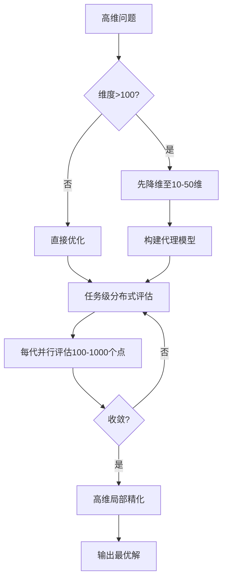

## local optimize

## 一、无导数优化方法（无需梯度信息）
1. **Nelder-Mead**：单纯形法（Simplex algorithm），基于几何单纯形的直接搜索方法，对非光滑问题具有鲁棒性，适用于边界约束问题 
2. **Powell**：Powell共轭方向法的改进版本，通过沿方向集进行序列一维最小化，不要求函数可微分 
3. **COBYLA**：约束优化线性逼近法（Constrained Optimization BY Linear Approximation），基于目标函数和约束的线性逼近 
4. **COBYQA**：约束优化二次逼近法（Constrained Optimization BY Quadratic Approximations），是COBYLA的改进版，采用无导数信赖域SQP方法，基于二次逼近处理目标函数和非线性约束，边界约束在整个优化过程中始终被严格遵守

### 二、一阶方法（仅需一阶导数/梯度）
5. **CG**：非线性共轭梯度法（Polak-Ribiere变体，Fletcher-Reeves方法的变种），仅使用一阶导数 
6. **BFGS**：拟牛顿法（Broyden-Fletcher-Goldfarb-Shanno），仅使用一阶导数，对非光滑优化也表现良好，返回Hessian逆矩阵的近似 
7. **L-BFGS-B**：有限内存BFGS算法，专为带边界约束的最小化问题设计 
8. **TNC**：截断牛顿算法（Truncated Newton），使用梯度信息处理带边界约束的问题，是Newton-CG的C语言实现版本 
9. **SLSQP**：序列最小二乘规划法（Sequential Least SQuares Programming），可同时处理边界、等式和不等式约束 

### 三、二阶方法（需要二阶导数/Hessian信息）
10. **Newton-CG**：牛顿-共轭梯度法（截断牛顿法），使用CG方法计算搜索方向，需要梯度和Hessian或Hessian-向量乘积，适合大规模问题 
11. **dogleg**：Dog-leg信赖域算法，需要梯度和Hessian（且Hessian必须正定） 
12. **trust-ncg**：牛顿共轭梯度信赖域算法，需要梯度和Hessian或Hessian-向量乘积，适合大规模问题 
13. **trust-krylov**：Newton GLTR信赖域算法，需要梯度和Hessian或Hessian-向量乘积，在不定问题上通常比trust-ncg迭代次数更少，推荐用于中大规模问题 
14. **trust-exact**：精确求解二次子问题的信赖域方法，需要梯度和Hessian（不要求正定），在许多情况下比Newton法收敛迭代次数更少，最适合中小规模问题 
15. **trust-constr**：信赖域约束优化算法，根据问题定义在Byrd-Omojokun Trust-Region SQP方法（仅等式约束）和信赖域内点法（含不等式约束）间切换，是SciPy中最通用且最适合大规模问题的约束优化算法 

### 四、算法选择建议
- **无导数需求**：优先选择Nelder-Mead、Powell（无约束/边界约束）或COBYLA/**COBYQA（一般约束**）
- **大规模问题**：推荐Newton-CG、trust-ncg、trust-krylov或trust-constr
- **中小规模精确求解**：trust-exact通常迭代次数最少
- **边界约束**：L-BFGS-B和TNC专为此类问题设计
- **复杂约束**：trust-constr最通用，SLSQP适用于混合约束类型

> 注：COBYQA算法于SciPy 1.14版本新增，旨在替代并改进原有的COBYLA算法 。所有算法的详细参数和适用条件请参考最新版SciPy官方文档。

## global optimize

根据SciPy官方文档和最新研究文献，以下6种全局优化算法的原理、特点及适用场景系统整理如下：

### 一、随机性全局优化算法

#### 1. **basinhopping（盆地跳跃算法）**
- **原理**：两阶段迭代算法，每轮迭代包含三步：(1)对当前解进行随机扰动；(2)对扰动后的点执行局部最小化；(3)基于Metropolis准则接受或拒绝新解 
- **特点**：
  - 专为具有"漏斗状但崎岖"能量景观的问题设计（如原子团簇能量最小化）
  - 内部调用`scipy.optimize.minimize`进行局部优化，可通过`minimizer_kwargs`参数自定义局部求解器 133
  - 适用于光滑标量函数的全局最小化 71
- **适用场景**：中低维连续优化问题，尤其适合存在多个局部极小值的"崎岖"能量面

#### 2. **differential_evolution（差分进化算法）**
- **原理**：基于群体的进化算法，由Storn和Price于1997年提出 85。通过种群中个体间的差分向量进行变异、交叉和选择操作 87
- **特点**：
  - 本质为随机算法，不依赖梯度信息，可搜索候选空间的广阔区域 29
  - 对非光滑、非凸问题具有强鲁棒性
  - 通常需要比基于梯度的方法更多的函数评估次数 29
- **适用场景**：黑盒函数优化、高维连续空间问题、导数不可用或计算昂贵的场景

#### 3. **dual_annealing（双重退火算法）**
- **原理**：结合经典模拟退火（CSA）与快速模拟退火（FSA）的广义模拟退火算法，并集成局部搜索（默认使用L-BFGS-B）103
- **特点**：
  - 通过双重退火过程加速收敛，避免陷入局部最优 45
  - 支持边界约束，自动在全局探索与局部精化间平衡 49
  - 函数调用次数受`maxfun`参数软限制（默认1e7）
- **适用场景**：中低维连续优化问题，尤其适合存在多个局部极小值的非凸问题

#### 4. **shgo（简化同调全局优化）**
- **原理**：基于组合拓扑学的Simplicial Homology Global Optimization (SHGO) 算法，由Endres等人于2018年提出 91。利用单纯形同调理论系统探索Lipschitz连续函数的全局最优解 96
- **特点**：
  - 适用于黑盒优化和无导数优化（DFO）问题 32
  - 支持边界约束、等式/不等式约束 36
  - 理论上可保证在有限步内找到全局最优解（对Lipschitz连续函数）96
- **适用场景**：中小规模约束优化问题，特别适合导数不可用或计算昂贵的黑盒函数

### 二、确定性全局优化算法

#### 5. direct（DIviding RECTangles算法）
- **原理**：由Jones等人于1993年提出的确定性分割算法 115。将搜索空间归一化为超立方体，通过迭代分割"潜在最优"超矩形（仅沿长边分割）系统采样 55
- **特点**：
  - 确定性算法（无随机性），适用于边界约束问题 53
  - 不需要导数信息，对黑盒函数友好 50
  - 在函数评估成本较低的问题上表现优异 56
- **适用场景**：低维（通常<10维）边界约束优化问题，特别适合计算廉价的黑盒函数

#### 6. brute（**暴力网格搜索**）
- **原理**：在参数空间的笛卡尔网格上穷举计算目标函数值，返回函数值最小的网格点 12
- **特点**：
  - 计算复杂度随维度指数增长（"维度灾难"）
  - SciPy实现中变量数量限制为40个 17
  - 可通过`Ns`参数控制每维网格点数，平衡精度与计算成本 12
- **适用场景**：极低维问题（通常≤3维）的粗略全局搜索，或作为其他算法的初始点生成器

### 三、算法选择建议（基于SciPy官方指南 120）

| 问题特征        | 推荐算法                            | 理由            |
| ----------- | ------------------------------- | ------------- |
| 低维+边界约束     | `direct`                        | 确定性采样，无需导数    |
| 中低维+多局部极小   | `basinhopping`/`dual_annealing` | 随机扰动跳出局部最优    |
| **高维+黑盒函数** | `differential_evolution`        | 群体搜索适应高维空间    |
| 约束优化+无导数    | `shgo`                          | 支持复杂约束且理论保证收敛 |
| 极低维粗略搜索     | `brute`                         | 简单直接但计算成本高    |

> **重要提示**：全局优化算法通常需要大量函数评估，建议先通过问题分析缩小搜索范围；对于可导问题，可结合局部优化器（如`minimize`）进行精细搜索。所有算法的最新参数和行为请参考[SciPy 1.17+官方文档](https://docs.scipy.org/doc/scipy/reference/optimize.html)。

## 多线程

目前**仅2种算法**在SciPy官方实现中直接支持通过`workers`参数启用并行计算：

| 算法 | 并行支持 | 实现方式 | 版本要求 |
|------|----------|----------|----------|
| **`differential_evolution`** | ✅ 支持 | 通过`workers`参数将种群划分为多个子集，使用`multiprocessing.Pool`并行评估目标函数 67 | ≥1.2.0 |
| **`shgo`** | ✅ 支持 | 通过`workers`参数并行执行采样点的目标函数评估（要求目标函数可pickle） 101 | ≥1.11.0 |

**使用示例**：
```python
# differential_evolution并行示例
from scipy.optimize import differential_evolution
result = differential_evolution(func, bounds, workers=4)  # 使用4个进程
# workers=-1 表示使用所有可用CPU核心

# shgo并行示例
from scipy.optimize import shgo
result = shgo(func, bounds, workers=4)
```

> **注意**：`differential_evolution`使用并行时需设置`updating='deferred'`（默认值），该模式与并行化兼容 89。

## 分布式

您总结得非常准确：**SciPy官方仅`differential_evolution`和`shgo`支持内置多进程并行（非严格多线程），分布式计算需自行实现**。针对高维问题（通常>50维）的分布式优化，单纯扩大计算规模往往效果有限（受"维度灾难"制约），需结合**算法重构+分布式架构+降维策略**。以下是经过工业实践验证的三层架构思路：

---

### 一、高维优化的核心挑战与应对原则
| 挑战 | 传统方案局限 | 分布式优化新思路 |
|------|--------------|------------------|
| **维度灾难** | 网格搜索/随机采样随维度指数爆炸 | 降维预处理 + 代理模型（Surrogate）引导采样 53 |
| **函数评估昂贵** | 单节点串行评估成为瓶颈 | 任务级并行：将独立采样点/种群个体分发到不同节点 11 |
| **收敛缓慢** | 全局算法在高维空间效率低下 | 混合策略：分布式全局探索 + 局部精化（如L-BFGS-B）45 |

> **关键原则**：高维问题优先考虑**降维+代理模型**，分布式仅作为加速手段而非根本解法 55

---

### 二、分布式架构三层实现方案（按优先级排序）

#### ▶ 方案1：任务级并行（最实用，推荐优先采用）
**适用算法**：所有全局优化算法（尤其`differential_evolution`, `shgo`, `basinhopping`）  
**核心思想**：将**独立的函数评估任务**分发到分布式集群，各节点仅需返回标量结果，通信开销最小。

```python
# 基于Ray的通用分布式框架（支持容错与弹性伸缩）
import ray
from scipy.optimize import differential_evolution

@ray.remote(num_cpus=1)
def evaluate_func(x, func_pickle):
    """分布式函数评估器（需确保func可pickle）"""
    import pickle
    func = pickle.loads(func_pickle)
    return func(x)

class DistributedDE:
    def __init__(self, func, bounds, cluster_address="auto"):
        ray.init(address=cluster_address)  # 连接Ray集群
        self.func_pickle = pickle.dumps(func)
        self.bounds = bounds
    
    def run(self, popsize=15, maxiter=100):
        # 1. 生成初始种群（本地）
        population = np.random.uniform(
            [b[0] for b in self.bounds],
            [b[1] for b in self.bounds],
            size=(popsize * len(self.bounds), len(self.bounds))
        )
        
        # 2. 分布式评估整个种群
        futures = [evaluate_func.remote(ind, self.func_pickle) for ind in population]
        fitness = ray.get(futures)  # 自动聚合结果
        
        # 3. 本地执行DE变异/交叉/选择（计算量小，无需分布式）
        # ... 标准DE逻辑（略）...
        
        # 4. 迭代中重复步骤2-3，每代并行评估新个体
        for _ in range(maxiter):
            new_population = self._generate_offspring(population, fitness)
            futures = [evaluate_func.remote(ind, self.func_pickle) for ind in new_population]
            new_fitness = ray.get(futures)
            # 更新种群...
        
        return best_solution
```

**优势**：
- ✅ 通信开销极低（仅传输标量结果）
- ✅ 天然容错：单个节点失败仅影响个别评估，可重试 32
- ✅ 与算法解耦：同一框架适配多种优化器
- ✅ 弹性伸缩：Ray自动管理worker生命周期 38

**技术栈推荐**：
- **Ray**（首选）：专为AI/优化工作负载设计，支持嵌套分布式任务（如`basinhopping`内嵌`minimize`）31
- **Dask**：适合与数据处理管道集成，但任务调度开销略高于Ray 45
- **MPI + mpi4py**：HPC场景下性能最优，但需手动处理容错与负载均衡 139

---

#### ▶ 方案2：算法级并行（针对特定算法定制）
| 算法                | 并行策略    | 实现要点                                           |
| ----------------- | ------- | ---------------------------------------------- |
| **DIRECT**        | 超矩形并行评估 | 将"潜在最优"超矩形列表分发到不同节点，同步更新全局最优 117           |
| **Basin-hopping** | 多起点并行   | 启动N个独立`basinhopping`实例（不同随机种子），最后取全局最优 129 |
| **差分进化**          | 种群分片    | 将种群划分为K个子种群，定期交换精英个体（Island Model） 16      |

> **注意**：算法级并行需修改算法内部逻辑，开发成本高，仅当任务级并行无法满足需求时采用。

---

#### ▶ 方案3：降维+代理模型（解决高维本质问题）
单纯分布式无法突破维度灾难，**必须结合降维技术**：
```python
# 高维优化标准流程（工业实践）
def high_dim_optimization(func, dim_high, dim_low=10):
    # Step 1: 降维（主动子空间/PCA/VAE）
    from sklearn.decomposition import PCA
    samples = np.random.uniform(0, 1, (1000, dim_high))
    values = [func(s) for s in samples]  # 初步采样
    pca = PCA(n_components=dim_low).fit(samples)
    
    # Step 2: 在低维空间优化
    def low_dim_func(z):
        x = pca.inverse_transform(z.reshape(1, -1))[0]  # 映射回高维
        return func(x)
    
    result_low = differential_evolution(low_dim_func, bounds=[(0,1)]*dim_low)
    
    # Step 3: 高维精化（可选）
    x_init = pca.inverse_transform(result_low.x.reshape(1, -1))[0]
    result_final = minimize(func, x_init, method='L-BFGS-B')  # 局部优化
    
    return result_final
```

**降维技术选型**：
- **线性降维**：PCA（适用于近似线性问题）72
- **非线性降维**：VAE、t-SNE（适用于复杂流形结构）69
- **主动子空间**：基于梯度信息识别敏感方向（需可导）53
- **随机投影**：Johnson-Lindenstrauss引理保证距离保持（理论保障）

> **实践建议**：先用100-1000次采样构建代理模型（如高斯过程/神经网络），在代理模型上执行全局优化，仅对候选解进行真实函数评估 61

---

### 三、分布式系统关键设计考量

| 问题 | 解决方案 | 工具支持 |
|------|----------|----------|
| **通信瓶颈** | 异步评估 + 批量提交（减少RPC调用） | Ray的`ray.wait()`支持异步获取 32 |
| **负载不均** | 动态任务队列（长尾任务自动重分配） | Ray的Object Store自动负载均衡 |
| **容错** | 任务级重试 + 检查点（每代保存种群状态） | Ray的`max_retries`参数 38 |
| **函数不可pickle** | 通过Ray Actor封装有状态函数 | `@ray.remote`修饰类 34 |

---

### 四、实施路线图（推荐顺序）



1. **第一步**：用100-500次采样分析问题结构，决定是否降维
2. **第二步**：部署Ray集群（3-10节点起步），实现任务级并行评估
3. **第三步**：集成代理模型（如scikit-learn的GPRegressor），减少真实函数调用
4. **第四步**：仅对Top-10候选解执行高维局部优化（L-BFGS-B）

> **经验法则**：高维问题中，**1次降维+代理模型 ≈ 10倍分布式节点带来的收益** 55。分布式应作为"加速器"而非"救生圈"。

---

### 五、参考资源
- **Ray官方教程**：[Distributed Hyperparameter Tuning](https://docs.ray.io/en/latest/tune/tutorials/tune-distributed.html) 38
- **高维优化综述**：*Bayesian and High-Dimensional Global Optimization* (Springer, 2021) 51
- **工业案例**：Uber使用Ray分布式XGBoost进行超参优化 31

通过"降维预处理 + 任务级分布式评估 + 代理模型引导"的三层架构，可有效应对100-1000维的全局优化问题，避免陷入单纯堆砌计算资源的误区。