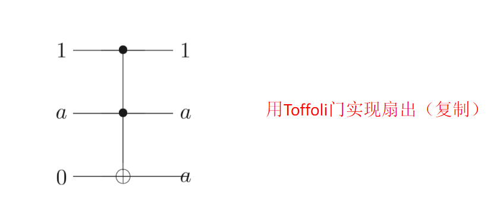
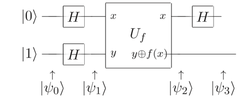

# 量子算法概要

## 2.1 The classic computation of quantum computer

### 问题

经典计算总是不可逆的，如与非门多输入单输出。

但是量子计算机是幺正演化，幺正演化可逆。$F^+ F=1\quad \therefore F^{-1}=F^+$

那么如何用可逆的逻辑门实现经典操作呢？

### 回答

Toffoli gate可实现与门、非门、复制（扇出）

非门：双受控输入为1时翻转比特。注意异或算法。

复制：双受控输入1、a即复制a。

## 2.2 量子并行性

对于某一个逻辑门f(x)，量子计算允许**控制位比特**为叠加态，或者理解为同时计算不同的x值下的输出。

注意第一章的Bell sate不是，因为他是两个比特输入直积态，而非一个受控比特输入叠加态。

### 受控异或门：

这种类似于C-not gate 的双比特有有控制位的不可以单独写。

正经写其作用应该是：

$$
U_f\frac{|00\rangle+|10\rangle}{\sqrt 2}=\frac{|0f(0)\rangle+|1f(1)\rangle}{\sqrt 2}
$$

### 拓展: 对于多位输入

核心在于这里的f(x)是一个很抽象的计算。他允许纠缠态除所有控制态输入，比如说两位输入。

$$
|\psi_0\rangle=(\frac{|0\rangle+|1\rangle}{\sqrt 2})(\frac{|0\rangle+|1\rangle}{\sqrt 2})|0\rangle=\frac{1}{2}(|000\rangle+|010\rangle+|100\rangle+|110\rangle)
$$

这玩意被f(x)作用后有：

$$
f(x)|\psi_0\rangle=\frac{1}{2}(|00f(00)\rangle+|01f(01)\rangle+|10f(10)\rangle+|11f(11)\rangle)
$$

这东西扩展一下就是：

$$
f(x)|\psi_0\rangle=\frac{1}{2^{\frac{n}{2}}}\sum_{x}|x\rangle|f(x)\rangle
$$

n为H gate 的个数。

但是我们测量模态只能得到一个$f(x)$, 而且我们压根不知道这是哪个 $|x\rangle$

## 2.3 Deutsch-Jozesa algorithm

由于这个并行性看上去一点用的没有，所以我们找点用。

### Deutsh algorithm

1. Gate
   
2. Operation

$$
|\psi_1\rangle=H_1H_2|\psi_0\rangle=\begin{Bmatrix}
1\\
-1\\
1\\
-1
\end{Bmatrix}
$$

f(x) have total 4 choice :

| f(0) | f(1) |  | 0 xor f(0) | 0 xor f(1) | 1 xor f(0) | 1 xor f(1) |
| ---- | ---- | - | ---------- | ---------- | ---------- | ---------- |
| 0    | 0    |  | 0          | 0          | 1          | 1          |
| 1    | 1    |  | 1          | 1          | 0          | 0          |
| 0    | 1    |  | 0          | 1          | 1          | 0          |
| 1    | 0    |  | 1          | 0          | 0          | 1          |

So f(x) have four kinds of $|\psi_2\rangle$

$$
|\psi_2\rangle=U_f|\psi_1\rangle=
\begin{Bmatrix}
1\\
-1\\
1\\
-1
\end{Bmatrix}

\begin{matrix}
|0&0xorf(0)\rangle\\
|0&1xorf(0)\rangle\\
|1&0xorf(1)\rangle\\
|1&1xorf(1)\rangle\\
\end{matrix}=\begin{cases}
\hat I|\psi_1\rangle;\quad f(0)=f(1)=0\\
\begin{Bmatrix}
X_2&O\\
O&X_2
\end{Bmatrix}|\psi_1\rangle;\quad f(0)=f(1)=1\\
\begin{Bmatrix}
I_2&O\\
O&X_2
\end{Bmatrix}|\psi_1\rangle;\quad f(0)=0,f(1)=1\\
\begin{Bmatrix}
X_2&O\\
O&I_2
\end{Bmatrix}|\psi_1\rangle;\quad f(0)=1,f(1)=0\\
\end{cases}=
\begin{cases}
|\psi\rangle\\
-|\psi\rangle\\
\begin{Bmatrix}
1\\
-1\\
-1\\
1
\end{Bmatrix}\\
\begin{Bmatrix}
-1\\
1\\
1\\
-1
\end{Bmatrix}
\end{cases}
$$

$$
|\psi_3\rangle=\hat H_1|\psi_2\rangle=\begin{Bmatrix}
1&0&1&0\\
0&1&0&1\\
1&0&-1&0\\
0&1&0&-1\\
\end{Bmatrix}|\psi_2\rangle=
\begin{cases}
\begin{Bmatrix}
2\\
-2\\
0\\
0
\end{Bmatrix}\\
\begin{Bmatrix}
-2\\
2\\
0\\
0
\end{Bmatrix}\\
\begin{Bmatrix}
0\\
0\\
2\\
-2
\end{Bmatrix}\\
\begin{Bmatrix}
0\\
0\\
-2\\
2
\end{Bmatrix}\\
\end{cases}=
\frac{1}{\sqrt 2}
\begin{cases}
\begin{Bmatrix}
1\\
-1\\
0\\
0
\end{Bmatrix}\\
\begin{Bmatrix}
-1\\
1\\
0\\
0
\end{Bmatrix}\\
\begin{Bmatrix}
0\\
0\\
1\\
-1
\end{Bmatrix}\\
\begin{Bmatrix}
0\\
0\\
-1\\
1
\end{Bmatrix}\\
\end{cases}
$$

3. Conclusion

**So we can only measure the first state is $|0\rangle$ or $|1\rangle$ to guess the f(x) is equal or xor** .

### The content of this game

1. Target :

$$
Judge:f(x)= 
\begin{cases}
all\quad are \quad 0\quad ,or\quad all\quad are\quad 1\\
half \quad of\quad 0 \quad and \quad 1
\end{cases}
$$

2. The logic gate

$\quad\quad$Evidently, it is the expansion of C-xor gate.

* Conclusion

Evently, If all the results from 1 to n-1 states are 0, meaning $f(0)=f(1)$ .

or else $f(0)\neq f(1)$ .

这个算法是一种傅里叶变换，但目前没用。
